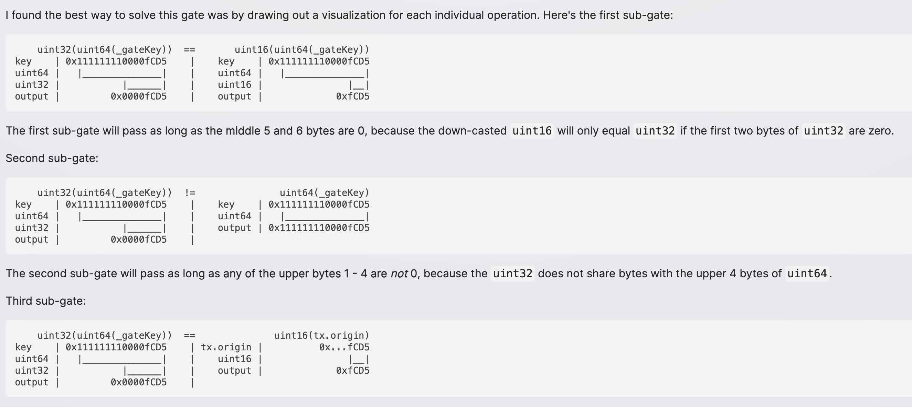

# 問題

GatekeeperOneコントラクトの変数entrantにアドレスを設定する

- level4-telephoneとlevel5-tokenが参考になるらしい
- gasleft使う必要がある


## 参考

https://dev.to/nvn/ethernaut-hacks-level-13-gatekeeper-one-3ljo

https://ardislu.dev/ethernaut/13


## ハック

### 前提

- entrantにtx.originを設定する関数のmodifierが3つあって、それぞれのバリデーション通る必要がある
- **Ethereumのアドレスは、基本的には20バイト（160ビット）の長さ**

- ビット演算について知っておくと解きやすい 

- modifier gateOneを通る
msg.sender != tx.originである必要があるので、コントラクトからの呼び出しが必要


- modifier gateTwoを通る
   - ガスの残り(gasleft)が、8191の倍数である必要がある
   - これは、ブルートフォースでgasの数がヒットするまでenter関数を呼びまくる。forでイテレーションする（実際には300にして成功した）


- modifier gateThree を通る
  - 以下三つの条件をクリアする必要がある
    - uint32(uint64(_gateKey)) == uint16(uint64(_gateKey))
    - uint32(uint64(_gateKey)) != uint64(_gateKey)
    - uint32(uint64(_gateKey)) == uint16(uint160(tx.origin))
    - ビット演算踏まえた上で解決した方が良いが簡単には以下の部分見たほうがわかりやすい



### 手順

#### gateOneへの対応

コントラクトからcallする

#### gateThreeへの対応
enter関数に渡す引数gateKeyを作る。


のようにやる。

- 最初の条件
  - 8bytes(64bit)のgateKeyをuint64->uint32とキャストしたもの、つまり最初のgateKeyの最初の8字とgateKeyの最初の4字を比べ、等しい必要がある。
　　- ここでビット演算で異なるバイト数の値を比べるときは、少ないバイト数の値を多い方に合わせる。合わせる際に頭に000..と0を足して合わせる。

- 2つ目の条件
  - 同じくgateKeyの最初の8字と、gateKey全体16字を比べて、等しくない必要がある。
    - つまりgateKeyが32bit以上の値である必要がある。

- 3つ目の条件
  - gateKeyの最初の8字と、tx.originのuint16、つまり最初の4字が等しい必要がある
    - **この条件により、gateKeyはtx.origin == contractを呼び出すEOAアドレスから生成される必要がある**

これらの条件から逆算して作れるgateKeyの一例は以下。ビットのことやビット演算がなんとなくしかわからない自分にはしっくりきた。

```sol
bytes8 key = 0x1111111100000000;
bytes memory keyArray = abi.encodePacked(key);

// Extracts last 2 bytes of an address: 0x000...1234 --> 0x1234
bytes2 lastTwo = bytes2(uint16(uint160(tx.origin)));
bytes memory lastTwoArray = abi.encodePacked(lastTwo);
// To pass gate 3 part 3
keyArray[6] = lastTwoArray[0];
keyArray[7] = lastTwoArray[1];
bytes8 gateKey = bytes8(keyArray);
```

#### gateTwoへの対応

gateTwoまで処理が来て、gasleftを使用した後のgasの残りが8191の乗算である必要がある。

これは複数のやり方があり、ネット上で王道とされてたのは、enterをcallしてあえてgateTwoで失敗するようにさせて、opcodeが見れるdebug機能内でGASを探すやり方。

自分の場合は、remixでローカル環境で実行すると、コントラクトからGatekeeperOneコントラクトを読んでいるはずなのになぜかtx.originとmsg.senderが同じだったので断念。

**直接sepolia上で、ブルートフォース攻撃しながら、etherscanでtxを確認し、右上の「More」->「Geth Debug Trace」を確認しながらやった。**


### ChatGPTへの質問

**最後のuint160になる理由がわからないです**

```solidity
require(uint32(uint64(_gateKey)) == uint16(uint160(tx.origin)), "GatekeeperOne: invalid gateThree part three");
```

*Ethereumのアドレスは、基本的には20バイト（160ビット）の長さを持っています。
Solidityでは、これらのアドレスを通常address型で扱いますが、数値操作を行いたい場面ではuint160にキャストして操作することが一般的です。
このmodifierの中でtx.origin（20バイトのアドレス）がuint160にキャストされているのは、その後でビットレベルでの操作（この場合は更にuint16にキャストする操作）を行いたいからです。
すなわち、uint160(tx.origin)とすることで、20バイト（160ビット）のアドレスを160ビットの整数に変換しています。この整数を更にuint16にキャストすることで、下位16ビットだけを取り出しています。このようにして、tx.originの下位16ビットと_gateKeyの下位32ビットを比較しています。そのために、tx.originをuint160にキャストしています。*

- Ethereumのアドレスは20bytes=160bitの長さ

**32bitと16bitの値を比較するときって、そもそもbit数が違うから常にfalseなんじゃないでしょうか**


*ビット数が異なる整数を比較する際には、通常、比較のために整数同士が同じビット数に拡張されます。言い換えれば、短いビット長の整数は比較のためにより長いビット長の整数に暗黙的に変換されることが多いです。例えば、uint16の0x1234（16ビット）とuint32の0x00001234（32ビット）があるとき、これらの値は等しいと見なされます。なぜなら、uint16の値がuint32に暗黙的に変換され、上位ビットに0が補われるためです。Solidityにおいても、このような型変換が暗黙的に行われます。したがって、uint32とuint16の値を比較する際には、uint16の値が暗黙的にuint32に変換され、その上で比較が行われます。このコントラクトでは、uint32(uint64(_gateKey))とuint16(uint64(_gateKey))を比較していますが、uint16(uint64(_gateKey))はuint32に変換されてから比較されるでしょう。この比較が真になる条件は、_gateKeyの下位16ビットと、その次の16ビット（ビット17-32）が同じである場合です。*

- ビット数が異なる整数を比較するときは、暗黙的に短い方の数字を長い方に合わせる
    - uint16 0x1234と uint32 0x00001234のとき2つは等しくなる


